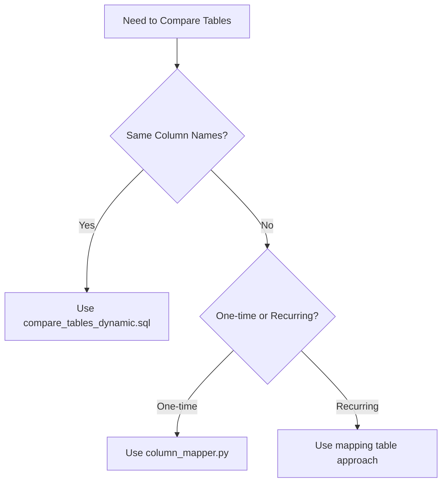

# Table Comparison Pattern - Complete User's Guide

> Part of the [Data Engineering Patterns](../../README.md) repository. See [Setup Guide](../../SETUP_GUIDE.md) for repository tools.

## Table of Contents
1. [Overview](#overview)
2. [Quick Start](#quick-start)
3. [Use Cases](#use-cases)
4. [Solution Components](#solution-components)
5. [Implementation Guide](#implementation-guide)
6. [Code Deep Dive](#code-deep-dive)
7. [Best Practices](#best-practices)
8. [Troubleshooting](#troubleshooting)
9. [Interview Talking Points](#interview-talking-points)

---

## Overview

### What is This Pattern?
A comprehensive solution for comparing two database tables column-by-column, identifying all differences, and handling the real-world complexity of different column names between tables.

### Why is This Important?
- **Data Migration Validation**: Verify data moved correctly between systems
- **Quality Assurance**: Compare staging vs production data
- **Audit & Compliance**: Track what changed between snapshots
- **Testing**: Validate ETL transformations produce expected results
- **Debugging**: Quickly identify data discrepancies

### The Challenge This Solves
```sql
-- The naive approach that everyone tries first:
SELECT * FROM table1
EXCEPT
SELECT * FROM table2

-- Problems with this:
-- 1. Doesn't show WHAT is different
-- 2. Doesn't handle NULL values correctly
-- 3. Doesn't work with different column names
-- 4. Doesn't tell you which rows differ
-- 5. Requires columns in exact same order
```

---

## Quick Start

### Scenario 1: Tables with Same Column Names

```sql
-- Use the basic dynamic comparison
CALL compare_tables('customers_old', 'customers_new', 'customer_id', 'public');

-- Results show exactly what's different:
-- key_value | column_name | table1_value | table2_value
-- 100       | email       | old@email   | new@email
-- 100       | status      | active      | inactive
-- 101       | phone       | 555-1234    | NULL
```

### Scenario 2: Tables with Different Column Names

```bash
# Use the Python mapper tool
python column_mapper.py

# Interactive prompts:
Enter first table name: customers_old
Enter columns for table1: cust_id, cust_name, cust_email, phone
Enter second table name: customers_new  
Enter columns for table2: customer_id, customer_name, email_address, phone_number

# Tool suggests mappings:
# cust_id -> customer_id (85% similarity)
# cust_name -> customer_name (90% similarity)
# cust_email -> email_address (75% similarity)
# phone -> phone_number (80% similarity)

# Generates SQL with proper mappings!
```

---

## Use Cases

### 1. Post-Migration Validation
**Scenario**: You've migrated from legacy system to new system
```sql
-- After running ETL from old_system to new_system
CALL compare_mapped_tables('migration_validation');

-- See exactly which records didn't migrate correctly
```

### 2. Daily Data Quality Checks
**Scenario**: Ensure overnight batch processing worked correctly
```sql
-- Compare yesterday's snapshot with today's
-- Only see records that actually changed
```

### 3. A/B Testing Data Platforms
**Scenario**: Running parallel systems to validate new platform
```sql
-- Compare outputs from System A vs System B
-- Identify discrepancies before cutover
```

### 4. Debugging Data Issues
**Scenario**: "The numbers don't match between reports!"
```sql
-- Compare the underlying data sources
-- Pinpoint exactly which fields differ
```

---

## Solution Components

### Component Architecture
```
┌─────────────────────────────────────────────┐
│          Table Comparison Suite              │
├─────────────────────────────────────────────┤
│                                               │
│  1. compare_tables_dynamic.sql               │
│     └─> Basic comparison (same column names) │
│                                               │
│  2. column_mapper.py                         │
│     └─> Interactive mapping tool             │
│         └─> Generates custom SQL             │
│                                               │
│  3. compare_tables_with_mapping.sql          │
│     └─> Database-driven mapping approach     │
│         └─> Reusable configurations          │
│                                               │
└─────────────────────────────────────────────┘
```

### File Descriptions

| File | Purpose | When to Use |
|------|---------|-------------|
| `compare_tables_dynamic.sql` | Dynamic SQL comparison without hardcoding | Tables have matching column names |
| `column_mapper.py` | Interactive tool for mapping different column names | One-off comparisons with different schemas |
| `compare_tables_with_mapping.sql` | Persistent mapping configuration in database | Recurring comparisons in production |
| `mapping_*.json` | Saved column mappings | Reusing previous mapping configurations |

---

## Implementation Guide

### Step 1: Assess Your Situation



### Step 2: For Same Column Names

```sql
-- Option A: If your database supports stored procedures
CREATE PROCEDURE compare_tables(
    table1_name VARCHAR,
    table2_name VARCHAR,
    join_key VARCHAR
)
-- [Full procedure code from compare_tables_dynamic.sql]

-- Option B: If no stored procedures, use the template approach
-- Manually build the UNION ALL query
```

### Step 3: For Different Column Names (Interactive)

```bash
# 1. Install Python dependencies (if needed)
pip install pathlib

# 2. Run the mapper
python column_mapper.py

# 3. Follow the interactive prompts
# The tool will:
#   - Analyze column names
#   - Suggest likely matches
#   - Let you edit/confirm mappings
#   - Generate the SQL
#   - Save mappings for reuse

# 4. Run the generated SQL in your database
```

### Step 4: For Different Column Names (Database-Driven)

```sql
-- 1. Create the mapping infrastructure
CREATE TABLE column_mappings (
    mapping_id INT AUTO_INCREMENT PRIMARY KEY,
    comparison_name VARCHAR(100),
    table1_name VARCHAR(100),
    table1_column VARCHAR(100),
    table2_name VARCHAR(100),
    table2_column VARCHAR(100),
    is_join_key BOOLEAN DEFAULT FALSE,
    is_active BOOLEAN DEFAULT TRUE
);

-- 2. Insert your mappings
INSERT INTO column_mappings 
(comparison_name, table1_name, table1_column, table2_name, table2_column, is_join_key)
VALUES 
('daily_validation', 'src_customers', 'cust_id', 'tgt_customers', 'customer_id', TRUE),
('daily_validation', 'src_customers', 'cust_name', 'tgt_customers', 'customer_name', FALSE);

-- 3. Create the stored procedure
CREATE PROCEDURE compare_mapped_tables(IN comparison_name VARCHAR(100))
-- [Procedure code from compare_tables_with_mapping.sql]

-- 4. Run comparisons by name
CALL compare_mapped_tables('daily_validation');
```

---

## Code Deep Dive

### Understanding the Core Logic

#### The Fundamental Pattern
```sql
-- For each column, we need to:
-- 1. Join the tables on the key
-- 2. Compare the values
-- 3. Include NULL handling
-- 4. Return only differences

SELECT 
    key_value,
    column_name,
    table1_value,
    table2_value
FROM (
    -- Compare each column
    SELECT 
        t1.id as key_value,
        'column1' as column_name,
        t1.column1 as table1_value,
        t2.column1 as table2_value
    FROM table1 t1
    FULL OUTER JOIN table2 t2 ON t1.id = t2.id
    WHERE t1.column1 != t2.column1 
       OR (t1.column1 IS NULL AND t2.column1 IS NOT NULL)
       OR (t1.column1 IS NOT NULL AND t2.column1 IS NULL)
    
    UNION ALL
    
    -- Repeat for each column...
) differences
ORDER BY key_value, column_name;
```

#### Why FULL OUTER JOIN?
```sql
-- INNER JOIN: Only compares records that exist in both tables
-- LEFT JOIN: Misses records that only exist in table2
-- RIGHT JOIN: Misses records that only exist in table1
-- FULL OUTER JOIN: Catches everything!

-- Example:
-- Table1: IDs 1,2,3
-- Table2: IDs 2,3,4
-- FULL OUTER gives us: 1,2,3,4 (complete picture)
```

#### The NULL Handling Challenge
```sql
-- This is wrong:
WHERE t1.column1 != t2.column1  -- NULL != NULL returns NULL, not TRUE!

-- This is correct:
WHERE t1.column1 != t2.column1 
   OR (t1.column1 IS NULL AND t2.column1 IS NOT NULL)
   OR (t1.column1 IS NOT NULL AND t2.column1 IS NULL)

-- Why? Because in SQL:
-- NULL = NULL returns NULL (not TRUE)
-- NULL != NULL returns NULL (not TRUE)
-- We must explicitly handle NULL cases
```

### Python Mapper Deep Dive

#### Similarity Scoring Algorithm
```python
def similarity_score(self, str1: str, str2: str) -> float:
    # Normalize strings by removing common variations
    str1 = str1.lower().replace('_', '').replace('-', '')
    str2 = str2.lower().replace('_', '').replace('-', '')
    
    # SequenceMatcher gives ratio of matching characters
    # "customer" vs "cust" = 0.615 (61.5% similar)
    # "email_address" vs "email_addr" = 0.846 (84.6% similar)
    return SequenceMatcher(None, str1, str2).ratio()
```

#### Pattern Recognition
```python
# Common database naming patterns
patterns = [
    (r'cust(omer)?', r'cust(omer)?'),  # cust, customer
    (r'qty|quantity', r'qty|quantity'),  # qty, quantity
    (r'(.+)_id$', r'(.+)_id$'),         # anything ending in _id
]

# Boost similarity score when patterns match
# "cust_id" and "customer_id" get extra points
# because they match the pattern
```

#### Why JSON for Mapping Storage?
```json
{
  "join_key_mapping": {
    "cust_id": "customer_id"
  },
  "column_mappings": {
    "cust_name": "customer_name",
    "cust_email": "email_address"
  }
}
```
- **Human-readable**: Easy to review and edit
- **Version control friendly**: Git can diff JSON files
- **Language agnostic**: Any tool can read JSON
- **Extensible**: Can add metadata without breaking existing code

---

## Best Practices

### 1. Performance Optimization

```sql
-- For large tables, add indexes on join keys
CREATE INDEX idx_compare_1 ON table1(join_key);
CREATE INDEX idx_compare_2 ON table2(join_key);

-- Consider comparing in chunks
WHERE t1.join_key BETWEEN 1 AND 10000  -- Process in batches
```

### 2. Data Type Handling

```sql
-- Always CAST to string for comparison to avoid type mismatches
CAST(t1.column AS VARCHAR) as table1_value

-- Why? 
-- Comparing INT to DECIMAL might fail
-- Comparing DATE to TIMESTAMP might fail
-- VARCHAR comparison always works
```

### 3. Handling Large Result Sets

```sql
-- Add filtering to focus on specific issues
WHERE key_value IN (SELECT key_value FROM known_problems)

-- Or sample the differences
ORDER BY RANDOM() LIMIT 1000  -- See a sample of differences
```

### 4. Documentation

```sql
-- Always document your mappings
INSERT INTO column_mappings (..., notes)
VALUES (..., 'Legacy system uses old naming convention');

-- Include comparison context
-- 'Pre-migration validation - Production to Staging - 2024-01-15'
```

---

## Troubleshooting

### Common Issues and Solutions

| Problem | Cause | Solution |
|---------|-------|----------|
| "FULL OUTER JOIN not supported" | Some databases don't support it | Use LEFT JOIN + RIGHT JOIN + UNION |
| Type conversion errors | Comparing incompatible types | CAST everything to VARCHAR |
| Performance is slow | No indexes on join keys | Add indexes, compare in batches |
| Too many false positives | Trailing spaces, case differences | Use TRIM() and UPPER() |
| Dates don't match | Timezone or precision differences | CAST to DATE or truncate timestamp |

### Database-Specific Adjustments

```sql
-- MySQL: No FULL OUTER JOIN
(SELECT ... FROM t1 LEFT JOIN t2 ...)
UNION
(SELECT ... FROM t1 RIGHT JOIN t2 ...)

-- PostgreSQL: Use EXCEPT for initial check
(TABLE table1 EXCEPT TABLE table2)
UNION ALL
(TABLE table2 EXCEPT TABLE table1)

-- BigQuery: Use EXCEPT DISTINCT
SELECT * FROM table1
EXCEPT DISTINCT
SELECT * FROM table2
```

---

## Interview Talking Points

### When to Bring This Up
- "How do you validate data migrations?"
- "How do you ensure data quality?"
- "Tell me about a complex SQL query you've written"
- "How do you debug data discrepancies?"

### Key Points to Emphasize

1. **Problem-Solving Approach**
   - "I recognized the limitation of simple EXCEPT queries"
   - "I built a reusable solution that handles real-world complexity"

2. **Technical Depth**
   - "The solution handles NULLs correctly, which many engineers miss"
   - "It works with different column names through mapping"
   - "It's database-agnostic with minor adjustments"

3. **Production Thinking**
   - "I built both one-off and recurring-use solutions"
   - "The mapping table approach provides auditability"
   - "Performance is optimized through indexing and batching"

4. **Business Value**
   - "This caught data issues that saved us from bad reports"
   - "Reduced data validation time from hours to minutes"
   - "Enabled confident production deployments"

### Example Interview Response

**Interviewer**: "How would you validate that a data migration worked correctly?"

**You**: "Great question! I actually have a pattern for this in my GitHub. Let me walk you through it...

First, the naive approach most people try - SELECT * EXCEPT - doesn't tell you what's different. 

So I built a comprehensive comparison tool that:
1. Dynamically compares any two tables without hardcoding columns
2. Handles different column names through mapping
3. Properly handles NULLs - which is trickier than most people realize
4. Returns exactly what's different, not just that something is different

Here's the actual code I use... [show repo]

The clever part is how it handles column mapping. In real migrations, column names often change. My Python tool automatically suggests mappings based on similarity scoring, then generates the SQL.

I've used this pattern to validate migrations involving millions of records. It's caught subtle issues like timezone conversions and trailing spaces that would have caused reporting discrepancies.

Would you like me to walk through the NULL handling logic? That's where a lot of comparison queries fail..."

---

## Summary

This table comparison pattern is a **production-ready, interview-winning solution** that demonstrates:
- Deep SQL knowledge
- Real-world problem solving
- Automation mindset
- Code reusability
- Documentation skills

It's not just a script - it's a complete solution that shows you think about:
- Edge cases (NULLs, data types)
- Usability (interactive tools, saved configurations)
- Maintenance (mapping tables, documentation)
- Performance (indexes, batching)
- Business value (catching data issues early)

**Remember**: The goal isn't just to compare tables - it's to build confidence in your data. This pattern does exactly that.